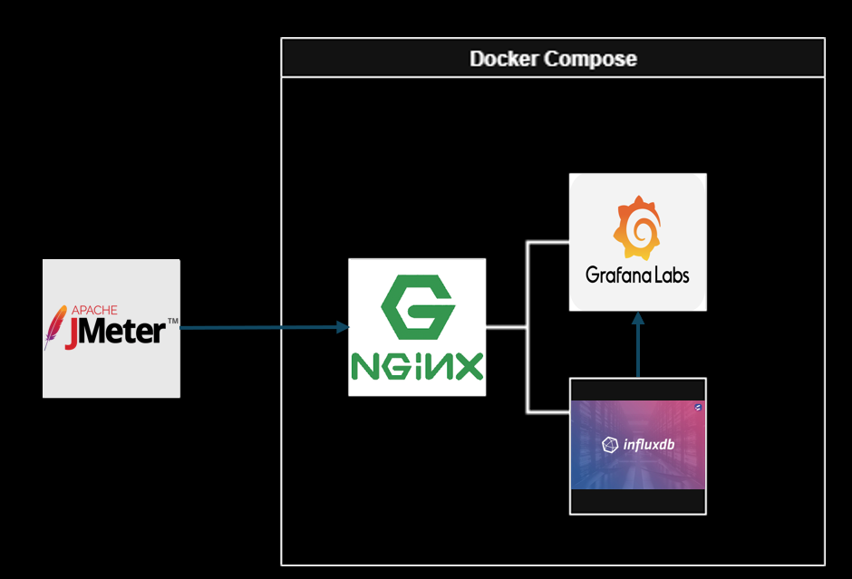

# Visualización de Pruebas con JMeter, Grafana & InfluxDB  

## Introducción  
Implementación de **dashboard de monitoreo y análisis de pruebas de performance** utilizando:  
- [Apache JMeter](https://jmeter.apache.org/) para la ejecución de pruebas.  
- [InfluxDB](https://www.influxdata.com/) como base de datos de series temporales para almacenar métricas.  
- [Grafana](https://grafana.com/) como plataforma de visualización.  

El objetivo es facilitar la **observación en tiempo real y el análisis histórico** de métricas de performance.  




En esta implementación se supone que Jmeter se encuentra instalado en un servidor dedicado y que los resultados son enviados a partir de un Backend Listener al subdominio correspondiente que puede estar alojado en otro servidor. 


## Requisitos Previos

- Docker y Docker Compose instalados.

- Acceso a red interna o subdominio configurado (opcional, si deseas acceso remoto).

- JMeter con el Backend Listener configurado para InfluxDB.

## Instalación y Configuración

1) Clonar el repositorio:

```
git clone https://github.com/ju4nc5r/dashboard_jmeter.git
cd dashboard_jmeter
```
2) Levantar servicios:
```
docker-compose up -d
```

3) Configurar JMeter:

    - Agregar un Backend Listener en tu test plan.

    - Seleccionar InfluxDB Backend Listener.

    - Configurar con los siguientes parámetros:


4) Acceder al Dashboard: 

En caso de ejecutarlo localmente:
- Grafana estará disponible en: http://localhost:3000

En caso de enviar los resultados al nginx: 
- Grafana estará disponible en: https://subdominio/grafana/

